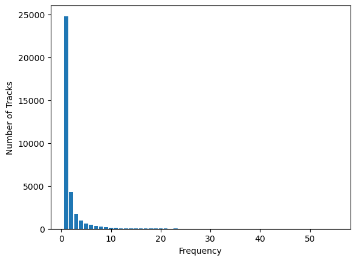

# Playlist Generation using Spotify's Million Playlist Dataset

We developed multiple **recommendation systems**, leveraging **collaborative filtering**, **co-occurrence-based similarity modeling**, and **Markov models** for automatic playlist continuation. Our work is inspired by the [Spotify Million Playlist Dataset Challenge](https://www.aicrowd.com/challenges/spotify-million-playlist-dataset-challenge).

Our **co-occurrence-based similarity model** significantly outperformed other approaches, demonstrating the effectiveness of track co-occurrence in playlist prediction. A detailed explanation of our work, including baseline evaluations using **k-NN** and **Random Forest** along with our evaluation pipeline can be found in [`report.pdf`](report.pdf).


## 📑 Table of Contents
1. [📂 Dataset](#-dataset)
2. [🔧 Setup](#-setup)
3. [🧪 Test Dataset Creation](#-test-dataset-creation)
4. [📥 Data Augmentation](#-data-augmentation)
5. [🧩 Models Implemented](#-models-implemented)
   - [🔬 Collaborative Filtering](#-collaborative-filtering)
   - [🎶 Co-occurrence Based Similarity Modeling](#-co-occurrence-based-similarity-modeling)
   - [🔗 Markov Chain](#-markov-chain)
6. [📏 Metrics Used](#-metrics-used)
   - [🎯 R-Precision](#-r-precision)
   - [📉 Normalized Discounted Cumulative Gain (NDCG)](#-normalized-discounted-cumulative-gain-ndcg)
   - [👆 Recommended Song Clicks](#-recommended-song-clicks)
7. [📊 Results](#-results)
   - [🆚 Comparing Model Performances](#-comparing-model-performances)
   - [🔀 Modeling Transitions between Tracks](#-modeling-transitions-between-tracks)
   - [🏆 AIcrowd Submissions](#-aicrowd-submissions)


## 📂 Dataset
The Spotify Million Playlist Dataset can be downloaded after registering for the challenge at the following link:
> https://www.aicrowd.com/challenges/spotify-million-playlist-dataset-challenge/dataset_files


## 🔧 Setup

To clone the repository, use the following command:
```sh
git clone https://github.com/Taejas/mpd-playlist-gen.git
```

The file [`requirements.txt`](requirements.txt) lists the required packages. These can be installed using the following command:
```sh
pip install -r requirements.txt
```

The directories `spotify_million_playlist_dataset` and `spotify_million_playlist_dataset_challenge` (from the downloaded dataset) must be placed inside a `Dataset` directory. This `Dataset` directory should be in the same directory as the notebooks.

The album and track scrapers in the `scraper` directory use the [`spotipy`](https://pypi.org/project/spotipy/) library. We used `spotipy 2.23.0` for this project.


## 🧪 Test Dataset Creation
Since the challenge dataset provided by the competition did not have any ground truth labels to compare our predictions, we took a subset of the dataset not used for training and converted it into a format identical to the challenge dataset format. To achieve this, we performed **stratified sampling** using the known tracks from our training data, while removing the unknown tracks. We then used the tracks held out from this dataset as the ground truth to evaluate the predictions generated by our models.

The notebook [`stratified_sampling.ipynb`](stratified_sampling.ipynb) contains the code for creating the test set. It contains the following key hyperparameters:
* **`N_TRAIN_K`**: Number of playlists (in thousands) that have been used for training a model to determine known tracks
  - We conducted our experiments with `N_TRAIN_K` set to `1`, `10`, `100` and `250`

* **`N_TEST_K`**: Number of playlists (in thousands) to sample for the test data
  - We kept `N_TEST_K` as `1` to mimic each scenario of the challenge dataset

* **`THRESHOLD_NUM`**: Minimum number of known tracks for each sampled playlist
  - We set `THRESHOLD_NUM` to `2` to align with scenario 2 (title and first track) of the challenge dataset
  - We also set the value to `26` to align with scenarios 7 (title and first 25 tracks) and 8 (title and 25 random tracks) of the challenge dataset

* **`THRESHOLD_PERC`**: Minimum percentage of known tracks for each sampled playlist
  - We kept `THRESHOLD_PERC` as `90` to ensure sufficient representation of songs while preventing popular tracks from dominating the playlist


## 📥 Data Augmentation

We used the Spotify Web API library [`spotipy`](https://pypi.org/project/spotipy/) to augment the dataset by scraping album and track level information. We wrote the following scripts to perform this task:
> Scraper for album data: [`spotify_album_scraper.py`](scrapers/spotify_album_scraper.py)

> Scraper for track data: [`spotify_track_scraper.py`](scrapers/spotify_track_scraper.py)

We found that models trained on augmented data underperformed compared to those trained on the provided data. As a result, we did not include the scraped data in our final models. A detailed explanation can be found in [`report.pdf`](report.pdf).


## 🧩 Models Implemented

### 🔬 Collaborative Filtering
> Notebook: [`mpd_collaborative_filtering.ipynb`](mpd_collaborative_filtering.ipynb)

We use collaborative filtering by first filtering out the top 100 playlists from the training set that have the highest cosine similarity with the test playlist. We then return the 500 most frequently occurring tracks across these filtered playlists as our recommendation.

We performed our experiments for test data with 25 provided tracks obtained using stratified sampling.

### 🎶 Co-occurrence Based Similarity Modeling
> Notebook: [`mpd_co_occurrence.ipynb`](mpd_co_occurrence.ipynb)

We extend our collaborative filtering approach by recommending tracks based on how often two tracks co-occur in the same playlist. We create a sparse matrix containing the co-occurrence values of every pair of tracks in a playlist during training. During prediction, the model retrieves the rows corresponding to the provided tracks in the test playlist and sums up the counts across columns to recommend the top 500 tracks.

As this was our best-performing model, we conducted extensive experiments with 25 provided tracks (both ordered and unordered) and a single provided track obtained using stratified sampling. We used this model's recommendations for our AIcrowd Challenge submission.

### 🔗 Markov Chain
> Notebook: [`mpd_markov_chain.ipynb`](mpd_markov_chain.ipynb)

We implemented a Markov chain by considering each track as a state to model the transitions in an ordered playlist. This allowed us to assess the importance of direct track-to-track transitions in a playlist.

We used a first-order Markov assumption, where only the current track in an ordered playlist determines the next track. Therefore, we worked with test data where only the first track in the playlist was provided.


## 📏 Metrics Used

We used the following evaluation metrics specified in the Spotify Million Playlist Dataset Challenge.

### 🎯 R-Precision
R-precision rewards tracks in the predicted set $S_T$ that have a higher number of tracks in common with the ground truth set $G_T$. It does not take the position of the generated tracks into account.

> $R\text{-precision} = \frac{|S_T \cap G_T|}{|G_T|}$

### 📉 Normalized Discounted Cumulative Gain (NDCG)
NDCG accounts for the position of the recommended tracks and increases when relevant tracks are placed higher in the recommendation list. A track $i$ is deemed relevant ($rel_i = 1$) if the track is also present in the ground truth recommendations, and irrelevant otherwise ($rel_i = 0$).

Discounted Cumulative Gain (DCG) is computed as follows:
> $\text{DCG} = rel_1 + \sum_{i=2}^{|R|} \frac{rel_i}{\log_2(i)}$

Here, $|R|$ denotes the size of the predicted set (always 500).

Ideal DCG (IDCG) is the case where every track in the predicted recommendations is ranked correctly as per the ground truth.

The NDCG is thus:
> $\text{NDCG} = \frac{\text{DCG}}{\text{IDCG}}$

### 👆 Recommended Song Clicks
Recommended Song Clicks refers to the number of refreshes needed to encounter a relevant track. By default, given a playlist, Spotify shows 10 track recommendations to add to the playlist and produces 10 more upon each refresh.

> $\text{Song clicks} = \left\lfloor \frac{\arg\min \{ R_i : R_i \in G \} - 1}{10} \right\rfloor$

## 📊 Results

### 🆚 Comparing Model Performances
We compared model performances using a reduced training set of the first 1,000 playlists, testing against another 1,000 playlists with 25 provided seed tracks.

Apart from k-NN and Random Forest, we used two additional strategies to get a measure of our baseline performance:
* **Random** &ndash; recommend 500 random tracks from the known tracks in the training data
* **Top-500** &ndash; recommend the 500 most frequently occurring tracks in the training data

The notebook [`mpd_top_500_and_random.ipynb`](mpd_top_500_and_random.ipynb) contains the code for generating recommendations using the above two strategies.

The following table shows our results:

| Model Name              | R-Precision | NDCG      | Song Clicks |
|-------------------------|:-----------:|:---------:|:-----------:|
| Random                  | 0.014       | 0.006     | 39.180      |
| k-NN                     | 0.050       | 0.021     | 27.786      |
| Random Forest           | 0.119       | 0.049     | 17.283      |
| Collaborative Filtering | 0.338       | 0.170     | 8.420       |
| Top-500                 | 0.338       | 0.171     | 8.387       |
| **Co-Occurrence**       | **0.647**   | **0.402** | **1.732**   |

#### Observations
* Collaborative filtering performs comparably to the Top-500 baseline, since the most frequent tracks obtained after identifying the top 100 similar playlists would be dominated by the higher frequency tracks.

* The following figure shows that 94% unique tracks in the first 1,000 playlists occur in 5 or fewer playlists. Thus, they are unlikely to be recommended by a collaborative filtering model based on cosine similarity.

  

* Co-occurrence based similarity modeling does not suffer from this limitation as it models the direct co-occurrence of tracks. We can see that it performs significantly better than all other approaches.

### 🔀 Modeling Transitions between Tracks
We experimented with a Markov chain to model the direct track-to-track transitions. We increased the training data to 10,000 playlists to capture greater transition information across tracks. For the test data, we used only the first track in the playlist as the seed to generate the subsequent tracks sequentially.

The following table shows the performance of the Markov chain along with the results obtained from some baseline strategies and the co-occurrence based approach on the same test data:

| Model Name        | R-Precision | NDCG      | Song Clicks |
|-------------------|:-----------:|:---------:|:-----------:|
| Random            | 0.003       | 0.001     | 46.295      |
| Markov            | 0.141       | 0.111     | 12.381      |
| Top-500           | 0.212       | 0.122     | 10.494      |
| **Co-Occurrence** | **0.409**   | **0.293** | **3.205**   |

#### Observations
* While the Markov chain does much better than random prediction, it still performs significantly worse than the Top-500 baseline. This is likely due to the sequential nature of the generation process. If a non-overlapping track gets predicted at any stage of the generation, the subsequent generations are also likely to be non-overlapping with the ground truth.

* Co-occurrence based similarity modeling performs surprisingly well even with a single seed track per playlist. This hints at strong correlations between song preferences, indicated by their co-occurrence in multiple playlists.

### 🏆 AIcrowd Submissions

We used the predictions obtained using co-occurrence based similarity modeling, which gave us the best results, to make our submission to the AIcrowd website hosting the Spotify Million Playlist Dataset Challenge. Details on the challenge dataset scenarios can be found [here](https://www.aicrowd.com/challenges/spotify-million-playlist-dataset-challenge#challenge-dataset).

We made three submissions by training the model on the following data:
1. First 100k playlists with all provided features and co-occurrence scores weighted by number of playlist followers
2. First 100k playlists with binary track information
3. First 250k playlists with binary track information

The following table shows our results, with the performance of the highest performing team of the ACM Recommender Systems Challenge 2018 [vl6 (Volkovs et al., 2018)](https://doi.org/10.1145/3267471.3267480) in the last row.

| Training Data                     | R-Precision | NDCG      | Song Clicks |
|-----------------------------------|:-----------:|:---------:|:-----------:|
| 100k (Weighted co-occurrence)     | 0.119       | 0.252     | 4.785       |
| 100k (Binary track info)          | 0.166       | 0.303     | 3.471       |
| **250k (Binary track info)**      | **0.167**   | **0.306** | **3.325**   |
| Winning Model (Team vl6)          | 0.224       | 0.395     | 1.784       |

#### Observations
* Using all provided features hindered the recommendation performance of our model, as it struggled to learn an effective co-occurrence weighting scheme due to the large variety of features. A binary co-occurrence weighting scheme was sufficient to generate high-scoring recommendations.

* Increasing the number of playlists from 100k to 250k has negligible effect on the performance, even though the number of unique tracks encountered in the training data increases by 64%. This is likely because the newly encountered tracks have a frequency that is low enough for them to not make it to the predictions, and the relative co-occurrence values largely remain the same.
